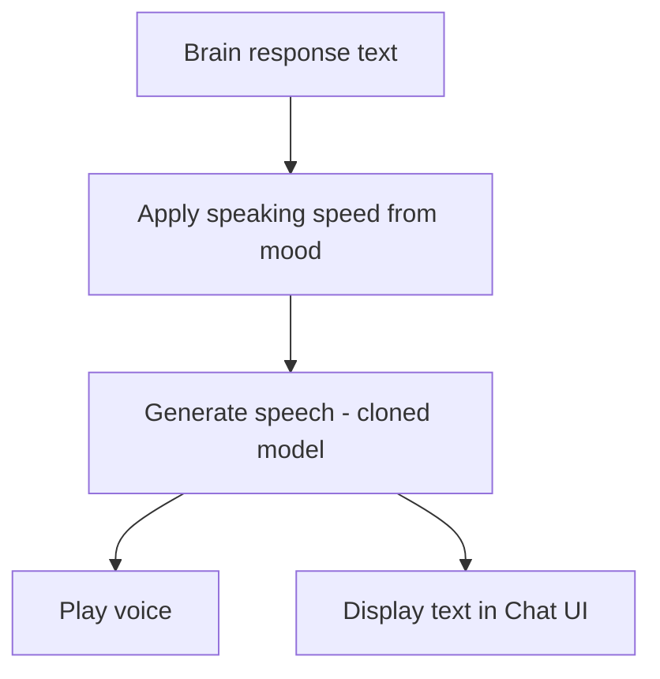

# Voice Output

Cloned-voice TTS with mood-based speed and simultaneous Chat UI text.

## Source Mapping

| Source | Reference |
|--------|-----------|
| voice.md | Section 3.2 (Output Behavior), §3.3 (Speaking Speed Adaptation) |
| voice-flow.mermaid | `O1`–`O4`; `CL6` → `O2` |

## Responsibilities

### Output behavior (§3.2)

- Every C.O.B.R.A. response is delivered as **both voice and text simultaneously**.
- Voice output uses the **cloned voice model at all times** (`O2` ← `CL6`).
- Text output appears in the **Chat UI** in sync with the spoken response (`O4`).

### Speaking speed adaptation (§3.3)

- Speaking speed adapts automatically based on mood inference (`O1`):
  - **Busy/stressed** → faster pace
  - **Relaxed/exploratory** → slower, more deliberate pace
- Speed adaptation is applied at **TTS generation time** — no post-processing
- Controlled by config `speaking_speed_adaptation` ([configuration.md](configuration.md))

Pipeline after brain:

1. `G` — Brain returns response text
2. `O1` — Apply speaking speed based on mood inference
3. `O2` — Generate speech using cloned voice model
4. `O3` — Play voice response
5. `O4` — Display text in Chat UI simultaneously

## Inputs / Outputs

| Direction | Content |
|-----------|---------|
| **In** | Response text from brain; mood from [mood-inference.md](mood-inference.md); cloned model |
| **Out** | Audio playback + text to Chat UI |

## Flow

## Rules and Constraints

- `output_mode: both` in config — voice + text always.
- Mid-response interruption handled by [interruption-handling.md](interruption-handling.md).

## Open Items

- [ ] Define behavior if cloned voice model file is missing or corrupted on startup

## Cross-References

- [voice-cloning.md](voice-cloning.md)
- [mood-inference.md](mood-inference.md)
- [interruption-handling.md](interruption-handling.md)
- [specs/chat-ui/chat-panel.md](../chat-ui/chat-panel.md)
- [specs/chat-ui/top-bar.md](../chat-ui/top-bar.md)
