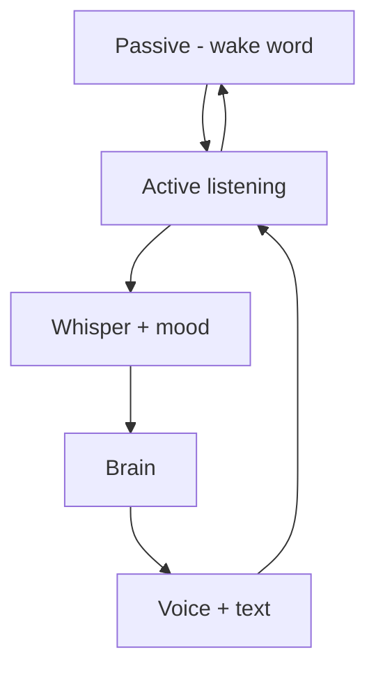

# C.O.B.R.A. Voice Layer — Component Overview

*Cognitive Optimized Brain for Retrieval and Action*

**Status:** Draft  
**Version:** 1.0 (decomposed)  
**Parent sources:** [../voice.md](../voice.md), [../voice-flow.mermaid](../voice-flow.mermaid)  
**Owner:** Damian  

---

## Purpose

The Voice Layer handles all audio input and output for C.O.B.R.A. It covers:

- Wake word detection and session end phrase
- Voice input transcription via Whisper
- Text-to-speech output using a cloned voice
- Session lifecycle management
- Audio privacy

**All voice processing runs locally — no audio data is ever sent externally.**

---

## High-Level Flow

Authoritative diagram: [../voice-flow.mermaid](../voice-flow.mermaid).

---

## Component Index

| Component | Spec | voice.md | voice-flow.mermaid |
|-----------|------|----------|-------------------|
| Wake Word | [wake-word.md](wake-word.md) | §1, §1.1 | `A`–`D`, `H`, `ACK` |
| Voice Input Pipeline | [voice-input-pipeline.md](voice-input-pipeline.md) | §2 | `INPUT` `I1`–`I5` |
| Mood Inference | [mood-inference.md](mood-inference.md) | §2.1 | `MOOD` `M1`–`M4` |
| Voice Cloning | [voice-cloning.md](voice-cloning.md) | §3.1, §7 | `CLONE` `CL1`–`CL7` |
| Voice Output | [voice-output.md](voice-output.md) | §3.2, §3.3 | `O1`–`O4` |
| Interruption Handling | [interruption-handling.md](interruption-handling.md) | §4 | `INTERRUPT` `IR1`–`IR4` |
| Session Lifecycle | [session-lifecycle.md](session-lifecycle.md) | §5 | `LIFECYCLE` `LC1`–`LC3` |
| Privacy | [privacy.md](privacy.md) | §6 | `PRIVACY` `PR1`–`PR4` |
| Configuration | [configuration.md](configuration.md) | §8 | Config-driven behavior |

**Implementation sequencing:** [implementation-plan.md](implementation-plan.md)

---

## Cross-Cutting Rules

1. **Local only** — wake word, Whisper, TTS; no cloud APIs ([privacy.md](privacy.md)).
2. **No raw audio storage** — transcriptions only ([voice-input-pipeline.md](voice-input-pipeline.md)).
3. **Cloned voice always** — output uses local model ([voice-output.md](voice-output.md)).
4. **Voice + text together** — simultaneous Chat UI display ([voice-output.md](voice-output.md)).
5. **No mid-response cutoff** — queue interruptions ([interruption-handling.md](interruption-handling.md)).
6. **No session timeout** — explicit end phrase only ([wake-word.md](wake-word.md)).

---

## Open Items (from voice.md)

- [ ] Define specific wake word detection library (e.g. Porcupine, OpenWakeWord)
- [ ] Define minimum acceptable Whisper transcription confidence threshold
- [ ] Define audio cue sound (tone, chime, or brief spoken acknowledgment)
- [ ] Define minimum voice sample quality requirements for cloning (microphone spec, environment)
- [ ] Define behavior if cloned voice model file is missing or corrupted on startup
- [ ] Define whether additional recording sessions append to or replace existing voice samples

Tracked in owner specs and [implementation-plan.md](implementation-plan.md).

---

*Decomposed from voice.md and voice-flow.mermaid. Parent spec remains authoritative; these files add implementable component boundaries.*
