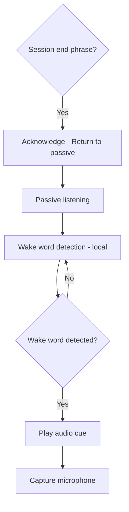

# Wake Word

Passive local listening for a custom wake word and session end phrase.

## Source Mapping

| Source | Reference |
|--------|-----------|
| voice.md | Section 1 (Wake Word), §1.1 Session End Phrase |
| voice-flow.mermaid | `A`, `B`, `C`, `D`; `H` / `ACK` session end |

## Responsibilities

### Wake word (§1)

- C.O.B.R.A. listens passively for a **custom wake word** defined by the user during setup.
- The wake word is **configurable** and stored in the config file ([configuration.md](configuration.md)).
- Upon detecting the wake word, C.O.B.R.A. plays a **short audio cue** (a subtle tone or chime) to confirm it is now listening (`D`).
- Wake word detection runs **locally at all times** — no cloud service used (`B`).

### Session end phrase (§1.1)

- C.O.B.R.A. stays **active and listening continuously** after activation.
- Session ends when the user says: **"That's all for now C.O.B.R.A."** (configurable via `session_end_phrase`).
- Upon hearing the session end phrase, C.O.B.R.A. **acknowledges** and returns to passive wake word listening mode (`ACK` → `A`).
- **No timeout** — C.O.B.R.A. never auto-ends a session.

## Inputs / Outputs

| Direction | Content |
|-----------|---------|
| **In** | Microphone stream; `wake_word` from config |
| **Out** | Activation signal → audio cue → capture (`E`); or session end → passive mode |

## Flow

## Rules and Constraints

- Wake word library choice is an open item (Porcupine, OpenWakeWord, etc.).
- Audio cue sound is an open item.

## Open Items

- [ ] Define specific wake word detection library (e.g. Porcupine, OpenWakeWord)
- [ ] Define audio cue sound (tone, chime, or brief spoken acknowledgment)

## Cross-References

- [session-lifecycle.md](session-lifecycle.md)
- [configuration.md](configuration.md)
- [privacy.md](privacy.md)
